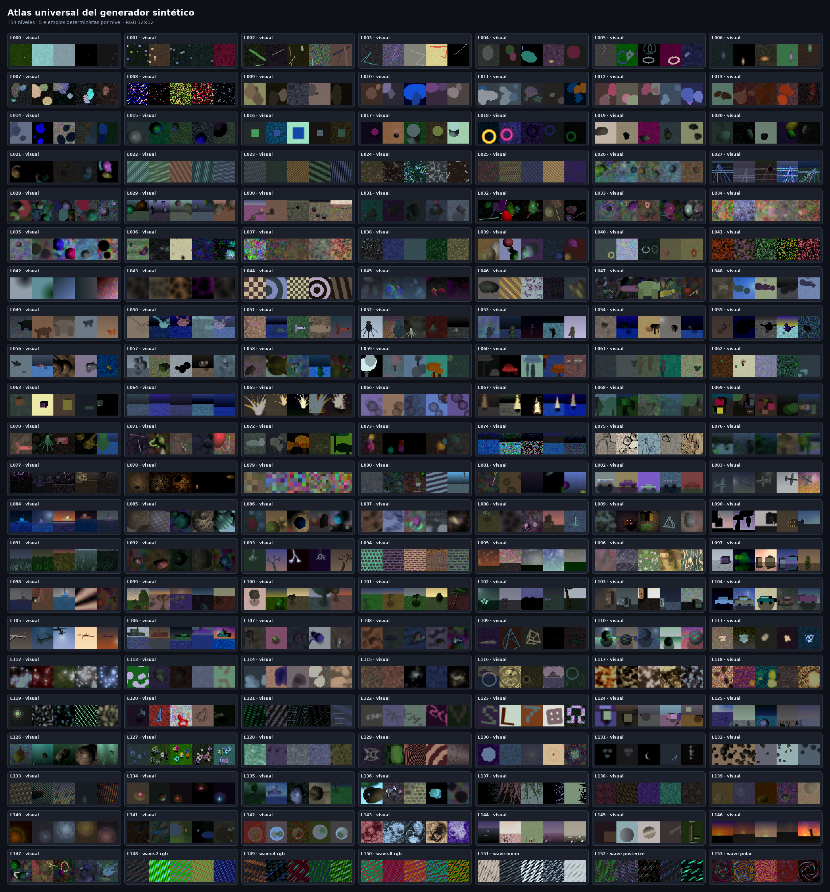
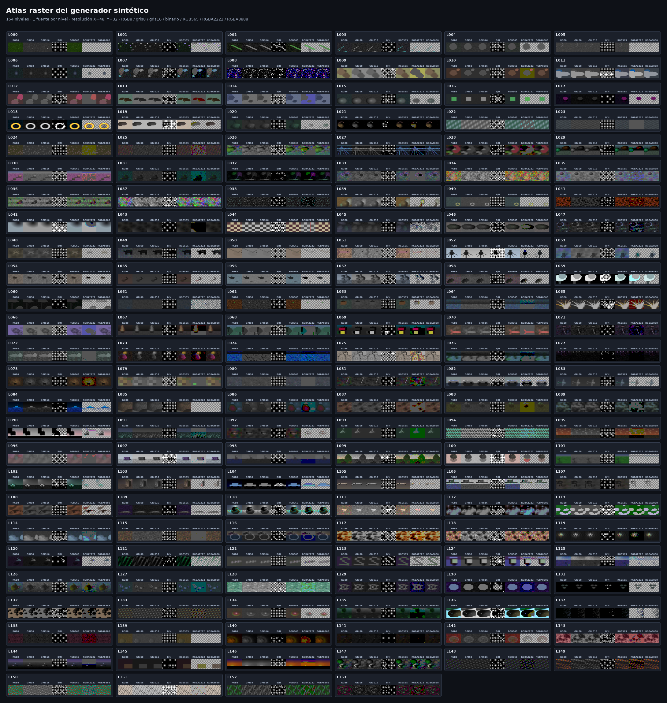

# IGC6 universal: paquete autocontenido

Esta carpeta contiene el modelo, el códec, el generador sintético de imágenes,
los datos exactos usados, datasets externos de evaluación, checkpoints
intermedios y evidencia. El código no depende de archivos del repositorio padre
ni contiene rutas absolutas hacia la máquina donde fue desarrollado.

## Modelo ganador

`checkpoints/legacy_ae/entropy/entropy_c128_igc6_universal_frontier.pt`

- SHA-256:
  `af90e4e9addd4163e0c56a438a3557e0c05c58509b2e5a02172b3d3ccb9a867b`
- Entrada y salida: RGB de 32 x 32.
- Latente cuantizado: 128 x 2 x 2 = 512 símbolos enteros.
- Archivo IGC6: cabecera de un byte más payload aritmético.
- CIFAR-train[45000:50000]: 120.271 bytes y 28.946901 dB.
- 2.0775 veces menor que WebP q40 a calidad equivalente.
- 3.6197 veces menor que el punto AVIF comparable medido.

Aquí “universal” significa que codifica una imagen RGB 32 x 32 no vista y no
que acepte arbitrariamente cualquier resolución. Para otra resolución hay que
redimensionar o entrenar una arquitectura multiescala.

## Atlas universal del generador

El siguiente atlas fue renderizado directamente con el snapshot incluido:
154 niveles y cinco ejemplos deterministas por nivel. Haga clic en la imagen
para verla a resolución completa.

[](media/synthetic_generator_universal_atlas.png)

Puede regenerarse sin datasets ni red usando:

```bash
python scripts/render_generator_atlas.py
```

## Instalación de la librería

Desde esta carpeta, la versión editable se instala con:

```bash
python -m pip install -e .
```

El paquete requiere Python 3.10 o posterior, NumPy y SciPy. Para desarrollar y
ejecutar las pruebas:

```bash
python -m pip install -e ".[dev]"
python -m pytest tests -q
```

El namespace público es `synthetic_image_generator`. El empaquetado mapea
directamente los módulos de `generators/`, por lo que no existe una segunda
copia del renderizador que pueda desincronizarse.

La versión actual es `0.2.0`. Los índices no tienen un límite superior: los
154 niveles se recorren cíclicamente mediante
`(idx // SAMPLES_PER_LEVEL) % N_LEVELS`, mientras que el bloque absoluto sigue
formando parte de la semilla. Por eso los ciclos posteriores conservan la
etiqueta del nivel sin repetir la geometría del primer ciclo. Los índices
`0..50049` mantienen el hash legacy exacto.

La decisión de fuente única, el inventario de snapshots encontrados y la
auditoría automática están en
[`SOURCE_OF_TRUTH.md`](SOURCE_OF_TRUTH.md). Para comprobar el workspace:

```bash
python scripts/audit_workspace_generator_sources.py
```

## API de escenas compuestas

Además de `make_image(idx)`, el generador acepta escenas estructuradas con
posiciones, dimensiones, color, luz y postprocesado explícitos:

```python
from synthetic_image_generator import (
    Background,
    LightSpec,
    ObjectSpec,
    PostSpec,
    RasterSpec,
    SceneSpec,
    make_scene,
    make_scene_raster,
)

scene = SceneSpec(
    background=Background(kind="gradient_sky", horizon=0.45),
    objects=[
        ObjectSpec(
            kind="sphere_3d",
            cx=16,
            cy=20,
            radius=5,
            color=(0.2, 0.6, 1.0),
        ),
        ObjectSpec(
            kind="building_3d",
            x=8,
            ground_y=22,
            width=12,
            height=18,
            color=(0.8, 0.7, 0.5),
        ),
    ],
    light=LightSpec(direction=(0.3, -0.6, 0.7)),
    post=PostSpec(style="realistic", grain=0.1),
)
image = make_scene(scene, seed=7)
```

El resultado es un `numpy.ndarray` RGB de forma `(32, 32, 3)`, tipo
`float32` y rango `[0, 1]`. El mismo `SceneSpec` y `seed` producen exactamente
la misma imagen. La API es paralela y no cambia el contrato de `make_image(idx)`.
La versión inicial expone la generación existente y no promete todavía convertir
los 154 niveles procedurales a una `SceneSpec` editable; esa conversión está
separada en `level_to_recipe()` y `level_to_spec()` dentro de
[`LIBRARY_PLAN.md`](LIBRARY_PLAN.md).

### Resolución, modo de color y bits por canal

`RasterSpec.width` define la resolución X y `RasterSpec.height` la resolución
Y. La forma de los arrays sigue la convención de NumPy: primero Y y luego X.

```python
# RGB de 8 bits por canal, resolución X=128, Y=64.
rgb8 = make_scene(
    scene,
    seed=7,
    raster=RasterSpec(
        width=128,
        height=64,
        mode="rgb",
        bits_per_channel=8,
    ),
)
assert rgb8.shape == (64, 128, 3) and rgb8.dtype.name == "uint8"

# Escala de grises de 16 bits: 65,536 niveles.
gray16 = make_scene_raster(
    scene,
    RasterSpec(
        width=80,
        height=120,
        mode="grayscale",
        bits_per_channel=16,
        resize="bicubic",
    ),
    seed=7,
)
assert gray16.shape == (120, 80) and gray16.dtype.name == "uint16"

# Blanco/negro puro con dithering: un bit lógico por píxel.
bitmap = make_scene(
    scene,
    raster=RasterSpec(
        width=96,
        height=48,
        mode="binary",
        bits_per_channel=1,
        dither="floyd_steinberg",
    ),
)
assert bitmap.shape == (48, 96) and bitmap.dtype.name == "bool"

# RGB565 empaquetado en un uint16 por píxel.
rgb565 = make_scene(
    scene,
    raster=RasterSpec(
        width=64,
        height=64,
        mode="rgb",
        bits_per_channel=(5, 6, 5),
        packed=True,
    ),
)
assert rgb565.shape == (64, 64) and rgb565.dtype.name == "uint16"

# RGBA2222: cuatro canales de 2 bits empaquetados en un byte por píxel.
rgba2222 = make_scene(
    scene,
    raster=RasterSpec(
        width=64,
        height=48,
        mode="rgba2222",
        alpha=1.0,
    ),
)
assert rgba2222.shape == (48, 64) and rgba2222.dtype.name == "uint8"
```

Los modos admitidos son `rgb`, `rgba`, `rgba2222`, `grayscale` y `binary`;
también se aceptan alias como `gray`, `bw`, `mono` y `bitmap`. La profundidad
puede ser de 1 a 16 bits por canal. El redimensionado puede ser `nearest`,
`bilinear` o `bicubic`, y el dithering `none`, `ordered` o
`floyd_steinberg`.
En modo binario, `packed=True` almacena ocho píxeles horizontales por byte y
produce una forma `(height, ceil(width / 8))`.
En `rgba2222`, los bits quedan ordenados como `RR GG BB AA`; `alpha` controla
la opacidad cuando la fuente original solo contiene RGB.

### Transparencia real para sprites y objetos 2D

Un fondo `transparent` inicia el lienzo con alfa cero. Cada objeto aporta su
máscara real —incluidos bordes suavizados, agujeros y subobjetos— y `opacity`
controla su opacidad individual:

```python
sprite_scene = SceneSpec(
    background=Background(kind="transparent"),
    objects=[
        ObjectSpec(
            kind="disc_with_rim",
            x=16,
            y=16,
            radius=7,
            color=(1.0, 0.2, 0.1),
            opacity=0.75,
        )
    ],
)

sprite = make_scene(
    sprite_scene,
    raster=RasterSpec(
        width=64,
        height=64,
        mode="rgba",
        bits_per_channel=8,
    ),
)
assert sprite.shape == (64, 64, 4)
assert sprite[0, 0, 3] == 0

from PIL import Image
Image.fromarray(sprite, "RGBA").save("sprite.png")
```

El redimensionado RGBA se realiza en color premultiplicado y después vuelve a
RGB recto, evitando los bordes negros habituales alrededor de sprites.

Para los niveles históricos de `make_image()`, `alpha_mode="auto"` —el valor
predeterminado— extrae el fondo únicamente en niveles orientados a objetos,
figuras, vehículos, criaturas, flora, glifos y geometría. Los niveles de
textura, paisaje o escena completa permanecen opacos:

```python
sprite = make_image(
    15 * 325,
    raster=RasterSpec(
        width=64,
        height=64,
        mode="rgba",
        alpha_mode="auto",
    ),
)
```

También se puede seleccionar `alpha_mode="opaque"` para desactivar el recorte,
`"background"` para forzarlo en cualquier nivel, o `"luminance"` para usar el
brillo como alfa en fuego, partículas y efectos emisivos. `RasterSpec.alpha`
multiplica el alfa final completo.

Para motores 2D y archivos PNG conviene usar RGBA de 8 bits sin empaquetar.
RGBA2222 es útil como representación compacta o formato de GPU, pero primero
debe desempaquetarse si se quiere guardar como PNG convencional.

La misma conversión está disponible para imágenes basadas en índice:

```python
from synthetic_image_generator import make_image_raster

small_gray = make_image_raster(
    42,
    RasterSpec(width=24, height=16, mode="grayscale", bits_per_channel=8),
)
```

El contenido se genera primero con el renderizador canónico de 32×32 y después
se redimensiona en precisión flotante antes de cuantizarse. Una resolución mayor
conserva bordes y gradientes suavizados, pero no inventa geometría adicional.

### Atlas compacto de formatos raster

Este atlas usa una sola fuente determinista por cada uno de los 154 niveles y
la muestra en RGB8, gris8, gris16, blanco/negro con dithering, RGB565 y
RGBA2222, seguida por RGBA8888 completa. Todas las variantes usan resolución
X=48, Y=32. Las dos columnas RGBA se componen sobre un tablero gris para hacer
visibles las zonas transparentes.

[](media/synthetic_generator_raster_atlas.png)

Puede regenerarse con:

```bash
python scripts/render_raster_atlas.py
```

## Reconstruir el caché sin descargarlo

No es necesario distribuir los 2.6 GB del caché. El generador incluido puede
crear desde cero el split, los índices y las imágenes FP16:

```bash
python generate_synthetic_dataset.py \
  --output-dir dataset_cache \
  --multiplier 10 \
  --seed 42
```

Esto produce 450,000 imágenes de entrenamiento y 5,000 de validación. El
resultado es determinista para la misma versión del código y del ambiente. No
pretende ser idéntico al caché histórico anterior al snapshot: genera un
dataset nuevo, equivalente en estructura y propósito.

También se puede entrenar un códec completamente sintético, sin CIFAR ni
ninguna descarga:

```bash
python legacy_single_modality/train_entropy_codec.py \
  --synthetic-only \
  --dataset-dir dataset_cache \
  --epochs 60 --batch-size 512 --lr 2e-4 --lambda-rd 0.0105 \
  --channels 128 --hidden 256 --downsample-layers 4 \
  --residual-blocks 4 --output-refine-blocks 16 \
  --context-refine-features 32 --feature-refine-width 32 \
  --quantization-mode ste --prior-components 5 \
  --autoregressive-prior \
  --selection-metric combined_rd \
  --output checkpoints/synthetic_igc6.pt
```

Este entrenamiento necesita CUDA, pero no requiere el checkpoint ni los
datasets distribuidos en la cápsula histórica.

## Uso rápido

Desde esta carpeta, con el ambiente Conda activo:

```bash
python scripts/verify_package.py
python scripts/verify_package.py --gpu

python legacy_single_modality/entropy_image_codec.py \
  compress imagen_32x32.png salida.igc6

python legacy_single_modality/entropy_image_codec.py \
  decompress salida.igc6 reconstruida.png
```

La compresión y descompresión neuronal requieren CUDA. La verificación básica
de integridad, datos y generador puede ejecutarse sin GPU.

Para recrear la comparación visual:

```bash
python legacy_single_modality/render_codec_comparison_grid.py
```

Esa comparación requiere CUDA y `ffmpeg` con `libaom-av1` disponible en `PATH`.
La imagen ya renderizada está en
`media/codec_comparison_gt_igc6_webp_avif.png`.

## Contenido

- `checkpoints/`: modelo final y los checkpoints necesarios de su linaje.
- `dataset_cache/`: caché sintético histórico exacto usado al entrenar.
- `generators/`: fuente canónica de la librería `synthetic-image-generator`.
- `data/CIFAR10/` y `data/MNIST/`: copias locales, sin descargas automáticas.
- `legacy_single_modality/`: arquitectura, entrenamiento, bitstream y benchmarks.
- `artifacts/` y `media/`: métricas y comparación visual congeladas.
- `scripts/render_generator_atlas.py`: recrea el atlas mostrado arriba.
- `TRAINING_RECIPE.md`: linaje y comandos de reproducción.
- `MANIFEST.sha256`: suma de cada archivo del paquete.

## Distinción crítica sobre el generador

El caché histórico fue creado antes de cambios posteriores al generador. El
snapshot incluido es determinista y completo, pero **no reproduce byte a
byte** los archivos históricos `dataset_cache/*.npy`. Por ello:

- Para reproducir este modelo o continuarlo, use `dataset_cache/`.
- Para un repositorio ligero, omita el caché y los checkpoints; cada usuario
  puede reconstruir un caché nuevo con `generate_synthetic_dataset.py`.
- No se sobrescribe ni se presenta el caché nuevo como si fuera el histórico.

## Ambiente

El ambiente probado fue Python 3.12.9, PyTorch 2.10.0+cu128,
torchvision 0.25.0+cu128 y FFmpeg 8.0.1. Puede recrearse con:

```bash
conda env create -f environment.yml
conda activate igc6-universal
```

Los paquetes de sistema/Conda no se duplican dentro de esta carpeta; todas las
fuentes, pesos y entradas específicas del experimento sí están incluidas.
